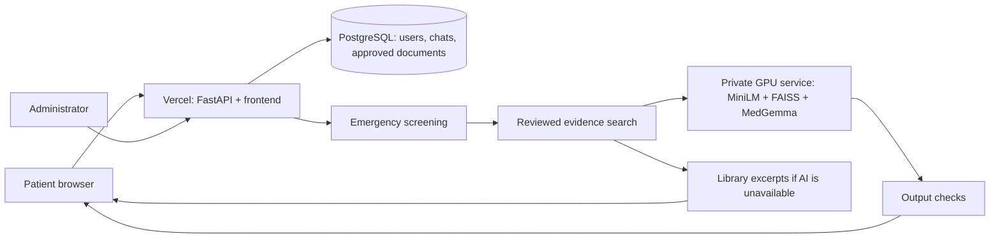

# MedAI

A primary healthcare education research application with a patient chat interface, reviewed health library, and administrator workspace.

## Run locally (Windows PowerShell)

```powershell
python -m venv .venv
.\.venv\Scripts\python.exe -m pip install -r requirements-dev.txt
Copy-Item .env.example .env
# Set JWT_SECRET in .env to a random secret; generate one with:
.\.venv\Scripts\python.exe -c "import secrets; print(secrets.token_urlsafe(48))"
.\.venv\Scripts\python.exe -m backend.manage init-db
.\.venv\Scripts\python.exe -m backend.manage create-admin
.\.venv\Scripts\python.exe -m backend.seed
.\.venv\Scripts\python.exe -m uvicorn main:app --reload
```

Open http://localhost:8000. Sign in as the administrator to review and publish draft articles. Patients can register themselves. Administrator creation prompts for a password privately; there are no default credentials. On macOS/Linux, use `.venv/bin/python` instead.

For a local-only quick setup, `python scripts/bootstrap_local.py` creates an administrator with a random password saved in the ignored `artifacts/local-admin.txt` file and imports the draft articles. It refuses production or PostgreSQL and never resets an existing administrator. Never upload the credentials file.

Without a configured inference service, the app returns clearly labeled excerpts from approved documents. It does **not** pretend to run MedGemma. With no relevant approved documents, it declines to invent an answer. Six short WHO-based drafts are included for review; these are not a complete validated clinical repository or Nigerian national guidelines.

## Features

- Registration/login with bcrypt, expiring JWT in HttpOnly cookies, and database-backed roles.
- Saved conversations, ownership checks, deletion, and per-reply feedback.
- Emergency keyword screening before retrieval or inference.
- Reviewed document search with visible source links and recent conversation context.
- Admin document creation/editing, text-file import, approval, withdrawal, and deletion.
- User activation controls, interaction inspection, usage charts, FAQ counts, JSON report export, and audit events.
- PostgreSQL for deployment; SQLite for local development.
- Separate authenticated GPU inference service using MedGemma 4B, MiniLM embeddings, and FAISS.
- Responsive frontend served by FastAPI, Vercel configuration, Dockerfiles, and GitHub Actions checks.

## Architecture



The GPU service builds an in-memory FAISS index from approved documents and caches it by a content fingerprint. A document edit/deletion causes a rebuild on the next request. PostgreSQL remains the source of truth. The Vercel app uses lexical retrieval for its non-AI fallback; it does not install PyTorch or FAISS. This first version sends the approved corpus to inference per request and is designed for a small research library, not a large deployment.

## Deploy

See [docs/DEPLOYMENT.md](docs/DEPLOYMENT.md) for GitHub, Vercel, PostgreSQL initialization, and GPU inference steps. The repository configuration alone does not provision external services.

Required production settings:

| Variable | Purpose |
| --- | --- |
| `DATABASE_URL` | Persistent PostgreSQL URL, with SSL as required by your provider |
| `JWT_SECRET` | Random secret, at least 32 characters |
| `APP_ENV` | `production` |
| `INFERENCE_URL` | Optional HTTPS base URL for the private GPU service |
| `INFERENCE_API_KEY` | Matching random shared key; required when inference is enabled |

Production refuses SQLite and weak/missing JWT secrets. Initialize the production database **before** deployment. Preview deployments should use a separate database and secret.

## Validation

```powershell
.\.venv\Scripts\python.exe -m pytest -q
node --check frontend/app.js
```

API tests cover access boundaries, authentication, document approval, context, feedback, deletion, rate limiting, emergency responses, inference failure, and unsafe-output rejection. They use an isolated temporary SQLite database. They do not establish clinical safety or validate MedGemma accuracy. See [docs/EVALUATION.md](docs/EVALUATION.md) for the research evaluation plan.

## Research limitations

This application is an educational research preview, not a clinically validated diagnostic or prescribing system. Keyword screening and output patterns are limited safeguards: they can miss unsafe language or trigger unnecessarily. Model grounding is prompt-based and does not prove that every generated claim is supported. Do not use the application for independent patient management.

Current operational limits: no email verification, password recovery, self-service account deletion, clinical reviewer credential checks, automatic document expiry, or database schema upgrade migrations. Lists are bounded (100 conversations per patient, 200 messages per conversation, 200 users in the admin list). Establish retention, backup, and operational policies before collecting real patient data. Avoid logging message bodies or inference prompts.

## Reference sources

- [Vercel FastAPI deployment](https://vercel.com/docs/frameworks/backend/fastapi)
- [Google MedGemma 4B model and access terms](https://huggingface.co/google/medgemma-4b-it)
- [MiniLM sentence embedding model](https://huggingface.co/sentence-transformers/all-MiniLM-L6-v2)
- [WHO malaria](https://www.who.int/news-room/fact-sheets/detail/malaria), [hypertension](https://www.who.int/news-room/fact-sheets/detail/hypertension), [diabetes](https://www.who.int/news-room/fact-sheets/detail/diabetes), [healthy diet](https://www.who.int/news-room/fact-sheets/detail/healthy-diet), [maternal health](https://www.who.int/health-topics/maternal-health), and [vaccination](https://www.who.int/news-room/questions-and-answers/item/vaccines-and-immunization-what-is-vaccination).

Reference pages checked during implementation on 15 September 2026. Seed content is paraphrased and imports as drafts.
